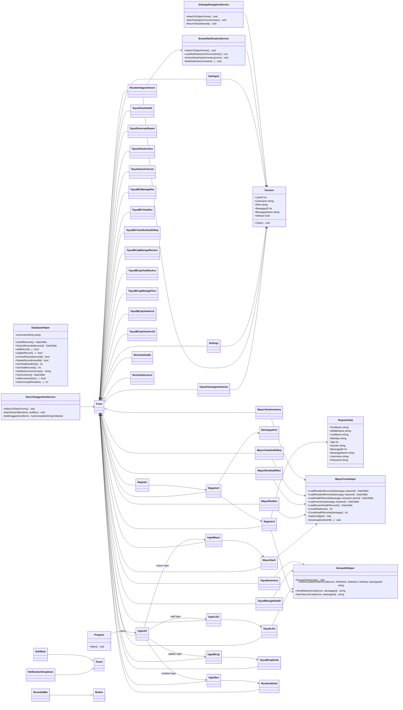
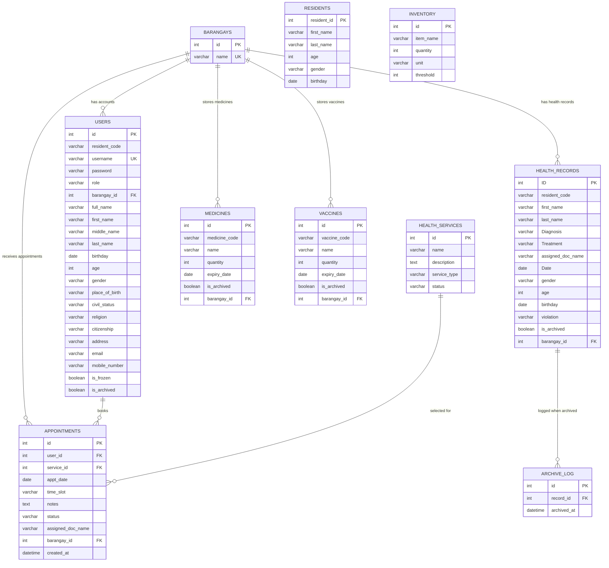
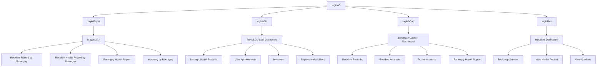

# B-SMART Class Diagram and Entity Relationship Diagram

These diagrams are generated from the current C# WinForms project structure and the MySQL tables referenced in the code.

## Class Diagram

## Entity Relationship Diagram

## Main Role Flow

